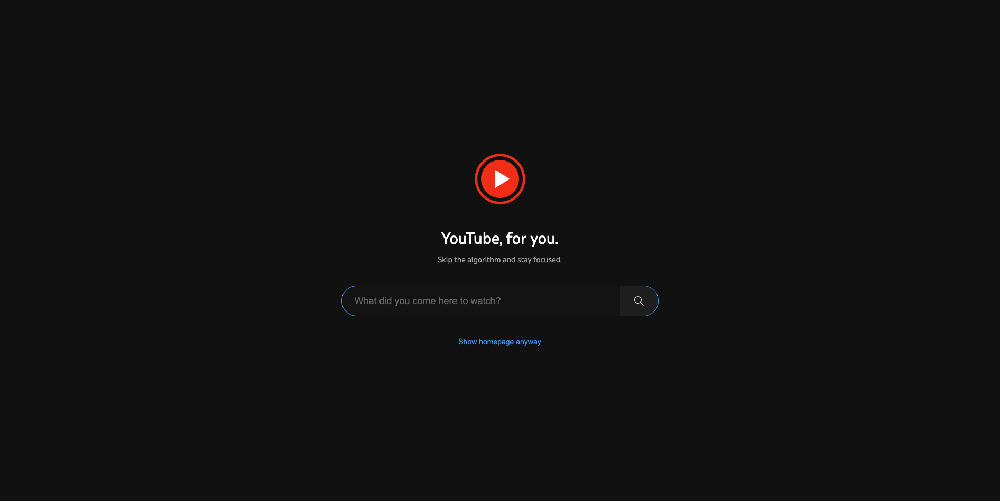

# YouTube ForYou

A Chrome extension that blocks YouTube's distracting homepage and replaces it with a focused search bar.

## Why?

YouTube's homepage is designed to keep you scrolling. You came to search for one thing, and 30 minutes later you're watching videos you never intended to watch.

ForYou replaces the homepage with a simple question: *"What did you come here to watch?"*

The irony? By removing YouTube's "For You" recommendations, it actually works **for you**.

## Features

- **Homepage Blocker** — Replaces the feed with a distraction-free overlay
- **Quick Search** — Jump straight to what you're looking for
- **Escape Hatch** — "Show homepage anyway" when you want to browse

## Installation

1. Download or clone this repository
2. Open Chrome and go to `chrome://extensions/`
3. Enable **Developer mode** (top right)
4. Click **Load unpacked** and select the folder

## License

MIT
